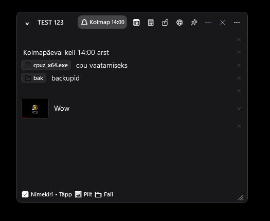

# SmartStickies (v1.0.0)

An ultra-modern, lightweight, and customizable desktop sticky notes application for Windows 11 and 10 built natively with **C# .NET 10.0 WPF** and **WinUI 3 Fluent Design principles**.

Designed for power users, gamers, and developers, SmartStickies blends seamlessly into your desktop wallpaper with adjustable transparency, natural language smart reminders, Google Keep-style checklists, an instant-search desktop Hub, and an ultra-low **~7.5–12 MB RAM footprint**.

### Preview


---

## 1. Key Features & Design

1. **WinUI 3 Fluent Design & Card Architecture:**
   - Soft 8px rounded corners, subtle drop shadows, and hardware-accelerated GDI/DWM rendering.
   - External gray border artifacts removed via custom DWM window attributes.
   - Clean 1-click collapse/expand (`⌄` / `>`) or header double-click to save desktop workspace.

2. **Desktop Wallpaper Transparency (Glass Contour):**
   - Smooth card opacity slider (e.g. 90%, 60%, 40%, etc.).
   - Card background effortlessly blends directly into your desktop wallpaper while **all text, checkboxes, and media remain 100% crystal-clear and readable**.
   - Subtle semi-transparent contour ensures crisp boundaries even on high-contrast photo wallpapers.

3. **Non-Aggressive Natural Language Date/Time Reminders (NLP Engine):**
   - **Zero Typing Interference:** Date and time recognition does not interrupt while typing. Evaluation triggers strictly upon pressing **Enter** or losing text box focus (**LostFocus**).
   - **Past Time Protection:** Typing relative dates without a time (e.g. "today") intelligently selects the next upcoming full hour, preventing immediate accidental alarms for hours already past.
   - Bilingual parsing in both English and Estonian (e.g. `today`, `tomorrow`, `friday 18:00`, `15th august at 14:00`, `täna`, `homme`, `laup 14:00`).

4. **Multi-Tier Offset Reminders & Toast Notifications:**
   - Configure multiple simultaneous alerts per note:
     - At event time (0 min)
     - 5 minutes before
     - 15 minutes before
     - 1 hour before
     - 1 day before
     - 1 week before
   - Interactive toast notifications with 10-minute snooze (`💤`), 1-click note focus (`📖`), and audio alert toggles.

5. **Manual Date & Time Picker:**
   - Built-in visual calendar `DatePicker` and time input field inside note settings (`⚙️`) for precise scheduling or instant dismissal.

6. **🧹 Clean Header Mode (`⋯` Action Toggle):**
   - Both Note cards and the Notes Hub feature a compact `⋯` button to collapse or expand secondary header action buttons (settings, lock, pin mode, calendar, hide, delete).
   - Each note and the Hub persistently remember their button visibility state.

7. **🔒 Read-Only Lock (`🔓` / `🔒`):**
   - One-click protection against accidental text overwriting.
   - When locked: title and text lines remain fully selectable and copyable (Ctrl+C), while line modifications, checkbox toggles, and deletion crosses are disabled, and the bottom toolbar is hidden.

8. **📋 SmartStickies Hub with Instant Search & Context Snippets:**
   - **Real-Time As-You-Type Search:** Instantly filters across note titles and content lines with a live match count badge (e.g. `2 / 8`).
   - **Contextual Quote Highlights:** When a match is found inside note body lines, a soft yellow italic snippet (`💬 ...found text...`) displays directly under the title.
   - **Resizable Dock:** Bottom-right grip handle (`GripResize`) allows freely resizing the Hub into a slim sidebar or corner widget.

9. **🗑️ Soft Delete & Recycle Bin (Trash Tab):**
   - Deleting a note performs a safe soft-delete (`IsDeleted: true`, `DeletedAt`).
   - The Hub features clean tabs for **`[ 📋 Notes (N) ]`** and **`[ 🗑️ Trash (M) ]`**.
   - In Trash mode: restore any note with 1-click (`↩️`), permanently erase with confirmation (`✕`), or empty the entire trash (`🗑️ Empty Trash`).
   - Notes in Trash never trigger background alarms.

10. **💾 Complete Backup, Export & Import (JSON & Markdown):**
    - **Export Backup (JSON):** Export all notes, reminders, attachments, and preferences into a single portable backup file.
    - **Export Markdown (.md):** Export all notes as a structured folder of clean `.md` files (with titles `#`, Keep checklists `- [x]`, bullet points, and timestamps), ready for Obsidian, Notion, or personal archives.
    - **Restore Backup (JSON):** Restore notes seamlessly with one click.

11. **Interactive Checklists & Rich Media Lines:**
    - Google Keep-style checklists: checking an item applies strikethrough and dims opacity; Enter creates the next checklist row.
    - Bulleted lists (`•`) with auto-continuation.
    - **Inline Attachments:** Drag and drop files or folders directly into a note to create an inline clickable chip ([📁 Folder] / [📄 File]).
    - **Image Attachments:** Paste images directly from the clipboard (Ctrl+V) or drop image files. Click any inline thumbnail to open the full-size `ImagePreviewWindow`.

12. **1-Click Google Calendar Sync (📅):**
    - 100% on-demand button opens Google Calendar in your default browser with pre-filled title, details, and scheduled reminder time. Zero background network requests.

13. **🔼 Instant System Tray "Bring All to Front":**
    - Left-clicking or double-clicking the SmartStickies system tray icon immediately brings **all active notes and the Hub to the absolute top of the screen (Z-order foreground)**.
    - Easily glance at your notes without minimizing or closing active games, full-screen browsers, or IDEs.

14. **Full Bilingual Localization:**
    - Seamless instant switching between **English** and **Estonian** across all windows, menus, tooltips, and toasts.

---

## 2. Installation & Quick Start

### Standalone Portable Release (Zero Dependencies)
1. Go to the [Releases](https://github.com/karumommik/SmartStickies/releases) page.
2. Download `SmartStickies-v1.0.0-win-x64.zip` (or `win-arm64` for ARM devices).
3. Extract `SmartStickies.exe` into any permanent folder on your computer.
4. Double-click `SmartStickies.exe` to run.
5. **Auto-start with Windows:** Open Settings (`⚙️`) and check **"Launch automatically on Windows startup"**.

---

## 3. Desktop Modes & Shortcuts

Each note supports 3 distinct window states via the `📌` header button:
1. 📌 **Pinned to Desktop (HWND_BOTTOM):** Sticks directly to the desktop wallpaper behind all active application windows.
2. 🔝 **Always on Top (TopMost):** Floats above other application windows.
3. 🪟 **Normal Window:** Standard Windows behavior.

* **Global Hotkeys:** Configurable in Settings (e.g. `Ctrl+Alt+N` for New Note, `Ctrl+Alt+S` to Show/Hide all notes).
* **System Tray Left-Click:** Instantly brings all notes and Hub to the foreground.

---

## 4. Release History & Changelog

### v1.0.0
* **Initial Official Release:** Modern lightweight desktop sticky notes application built on .NET 10.0 WPF and WinUI 3 Fluent Design principles.
* **Ultra-Low RAM Architecture:** Engineered to run at ~7.5–12 MB physical working set memory with zero background CPU overhead.
* **Wallpaper Transparency Engine:** Real-time opacity blending with semi-transparent glass contour for full legibility over dynamic wallpapers.
* **Smart Natural Language Scheduling:** Non-aggressive date/time parsing on Enter/LostFocus with multi-offset alarm intervals (at event, 5 min, 15 min, 1 hr, 1 day, 1 week).
* **SmartStickies Desktop Hub:** Full resizable dock with real-time search, context snippet highlights, and active/hidden toggles.
* **Recycle Bin (Trash Tab):** Soft delete protection with one-click restore and batch empty.
* **Clean Header Toggle (`⋯`):** Collapse/expand secondary header actions on notes and Hub for minimalist aesthetics.
* **Read-Only Lock (`🔓` / `🔒`):** Write-protection toggle keeping notes selectable/copyable while preventing accidental edits.
* **Backup & Export Center:** Full JSON backup/restore and clean Markdown folder export for Obsidian/Notion.
* **Inline Media Attachments:** Drag-and-drop file/folder chips and clipboard image pasting with full-screen viewer.
* **1-Click Google Calendar Sync:** On-demand browser event creation.
* **System Tray Quick-Access:** Single click brings all notes to front without minimizing background games or browsers.
* **Full Bilingual Support:** Complete English and Estonian localization.
* **SEC Compliance Audit:** Verified 100% non-elevated user mode, zero background telemetry, and local JSON storage.

---

## 5. Technical Architecture & Ultra-Low RAM Footprint

* **Platform:** C# 10.0 / .NET 10.0 WPF (Windows Forms hybrid for high-performance tray integration).
* **Physical Memory Footprint:** ~7.5–12 MB RAM (over 95% lighter than standard Electron or heavyweight desktop note apps):
  1. **Zero External UI Bloat:** Uses native, tuned WPF control templates instead of bulky 80MB+ third-party vector libraries.
  2. **Workstation GC Mode (`ServerGarbageCollection = false`):** Eliminates multi-threaded server heap allocation.
  3. **Virtual Memory Return (`System.GC.RetainVM = false`):** Unreferenced pages return directly to the Windows kernel.
  4. **Dynamic Working Set Trimming:** SystemIdle priority trimmer gently compacts unreferenced physical pages.
  5. **Performance-Biased Drop Shadows (`RenderingBias="Performance"`):** Eliminates CPU bitmap caching overhead.
  6. **0.00% Idle CPU:** Event-driven timers and low-frequency reminder ticks ensure zero frame drops during gaming.

---

## 6. CI/CD Release Pipeline & Deployment

Releases are fully automated via the **GitHub Actions workflow** (`.github/workflows/release.yml`).
To publish a new release:
1. Increment `<Version>X.Y.Z</Version>` in `SmartStickies.csproj`.
2. Document the changes under `## 4. Release History & Changelog` in `README.md`.
3. Create and push a git tag matching `v*`:
   ```bash
   git tag v1.0.0
   git push origin v1.0.0
   ```
4. The GitHub Actions runner will automatically build the self-contained `win-x64` and `win-arm64` ZIP packages, generate `.sha256` integrity files, extract release notes from `README.md`, and publish the official GitHub Release.

---

## 7. 🔒 Security, Privacy & System Access Audit (SEC Compliance)

This section provides an enterprise security and compliance breakdown for IT Security Officers (CISO / SEC), System Administrators, and ISO 27001 compliance auditors.

| Audit Category | Security Implementation Details | Risk Assessment |
| :--- | :--- | :---: |
| **Execution Privileges** | Runs strictly in **User Mode (Non-Elevated)**. Does **NOT** require Administrator/UAC elevation. | 🟢 **Zero Risk** |
| **System Isolation** | Standalone Win32/WPF process. Interacts through standard Windows APIs without injecting DLLs into `explorer.exe` or third-party processes. | 🟢 **Zero Risk** |
| **Input & Focus Safety** | Uses standard window messaging. Does **NOT** intercept global keystrokes or run keyloggers. Optional global hotkeys use standard Windows `RegisterHotKey` API. | 🟢 **Zero Risk** |
| **Network & Telemetry** | **0% Network Traffic**. Zero background telemetry, analytics, tracking, or remote server calls. | 🟢 **Zero Risk** |
| **External Sync (Google Cal)** | Google Calendar integration runs strictly on-demand upon explicit user button click via standard browser URL navigation (`https://calendar.google.com`). | 🟢 **Zero Risk (User-Controlled)** |
| **Data Storage at Rest** | Notes and settings are stored locally in user profile `%APPDATA%\SmartStickies\notes.json` as human-readable JSON. Attachments reside in `%APPDATA%\SmartStickies\media\`. | 🟢 **Zero Risk** |
| **Registry Footprint** | Optional startup configuration writes strictly to user-scope `HKCU\Software\Microsoft\Windows\CurrentVersion\Run`. Does **NOT** modify machine-wide `HKLM`. | 🟢 **Zero Risk** |
| **Hardware & Peripherals** | **0% access** to microphone, webcam, location, or biometric devices. | 🟢 **Zero Risk** |
| **Deserialization Safety** | Data serialization is performed strictly with type-safe `System.Text.Json` (no vulnerable `BinaryFormatter`). | 🟢 **Zero Risk** |

---

## 📄 License
Released under the MIT License. Developed with pride by [karumommik](https://github.com/karumommik).
